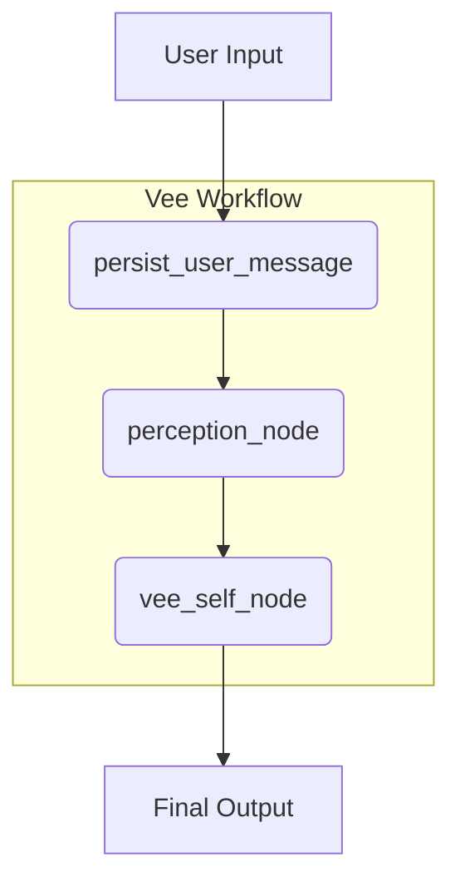

# Vee: An Empathetic AI Companion 🧠❤️

Vee is a next-generation AI companion built on a sophisticated, state-aware architecture. Powered by LangGraph, Vee uses a dynamic workflow and a structured personality framework to deliver conversations that are not just intelligent, but genuinely empathetic and attuned to you.

## Recent Updates

- **New Personality Framework**: Implemented a more robust and structured personality model for more consistent and nuanced interactions.
- **Stability Fixes**: Resolved critical bugs related to state management and timezone handling, significantly improving application performance and reliability.

## Core Features

Vee is more than just a chatbot; it's a versatile companion designed to handle a wide range of needs.

- **Structured Personality Framework**:
    - Vee's personality is defined by a clear and powerful framework that separates stable traits from dynamic moods and contextual stances.
    - **Core Traits**: Defines the base personality (e.g., Openness, Agreeableness).
    - **Current Mood**: Adapts in real-time to the user's emotional state (e.g., empathetic, playful, focused).
    - **Relationship Stance**: Adjusts its role based on the conversational context (e.g., supporter, collaborator, mentor).

- **Deeply Context-Aware**:
    - Vee analyzes the user's emotional state, intent, and dialogue act (`perception_node`) to dynamically adjust its mood and stance, ensuring its responses are always appropriate.

- **Context-Aware Conversation**:
    - Vee remembers the last few turns of your conversation, ensuring its responses are relevant and follow the flow of dialogue.
    - It analyzes your emotional state and conversational intent (`sense_text_node`) to tailor its responses appropriately.

- **Safety First**:
    - Every user message is analyzed by a `safety_triage_node` to assess risk and ensure conversations remain safe and constructive.

- **Dynamic UI**:
    - The system can present interactive buttons, allowing for clearer user feedback and control over the conversation flow.

## Technical Architecture

Vee's intelligence is orchestrated by a streamlined, modular LangGraph workflow.



### Key Components

- **`persist_user_message`**: Saves the user's message to the database, ensuring a persistent conversation history.
- **`perception_node`**: The core of Vee's awareness. It analyzes the user's message to extract emotional tone, intent, and other key pragmatic signals.
- **`vee_self_node`**: The heart of the persona. This node takes the rich context from the `perception_node` and the new `personality_profile` to generate a deeply empathetic and context-aware response.
- **Structured Personality Prompt**: The `vee_self.md` prompt now contains a sophisticated `<personality_profile>` that guides the LLM's behavior, separating stable traits from dynamic moods and contextual stances.

## Getting Started with Docker

This project is fully containerized with Docker, making setup and deployment straightforward for both local development and production.

### Prerequisites

- [Docker](https://docs.docker.com/get-docker/)
- [Docker Compose](https://docs.docker.com/compose/install/)

### Environment Variables

Before you begin, create a `.env` file in the root of the project and add your API keys and tokens:

```
GROQ_API_KEY="your_groq_api_key_here"
TELEGRAM_BOT_TOKEN="your_telegram_bot_token"
WEBHOOK_URL="your_ngrok_or_vps_url/webhook" # e.g., https://heyyvee.com/webhook
```

### Local Development

For local development, the application uses an Nginx configuration that listens on `http://localhost`.

1.  **Build and run the containers:**
    ```bash
    docker-compose up --build
    ```
    This will start the application. By default, Nginx is mapped to port 90 to avoid conflicts on local machines (`http://localhost:90`).

2.  **Set the Telegram Webhook (if using Telegram):**
    You'll need a tool like [ngrok](https://ngrok.com/) to expose your local server to the internet. Once you have your ngrok URL, set the webhook:
    ```bash
    curl -F "url=https://your-ngrok-url.io/webhook" https://api.telegram.org/bot<YOUR_TELEGRAM_BOT_TOKEN>/setWebhook
    ```
    Remember to update the `WEBHOOK_URL` in your `.env` file with the ngrok URL.

### Production Deployment

The production setup uses Nginx with SSL certificates from Let's Encrypt, managed by Certbot.

1.  **Server Setup**:
    - Get a VPS and install Docker and Docker Compose.

2.  **Run the Application**:
    On your VPS, run the following command to start the application using the production Nginx configuration:
    ```bash
    NGINX_CONF=prod.conf docker-compose up -d --build
    ```

3.  **Obtain SSL Certificate**:
    With the containers running, execute the Certbot command to get your SSL certificate. This command requests a certificate for multiple domains.
    ```bash
    docker-compose run --rm certbot certonly --webroot --webroot-path /var/www/certbot --email your-email@example.com --agree-tos --no-eff-email -d abc.com -d abs.abc.com
    ```

4.  **Restart Nginx**:
    After the certificate is successfully created, restart Nginx to apply the new SSL configuration:
    ```bash
    docker-compose restart nginx
    ```
    Your application is now live

## Dependencies

- Python 3.8+
- LangChain & LangGraph
- Groq for LLM inference
- Pydantic for data modeling
- python-telegram-bot for the Telegram UI
## License

MIT License - Feel free to use and modify as needed.
